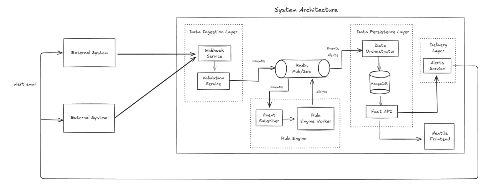
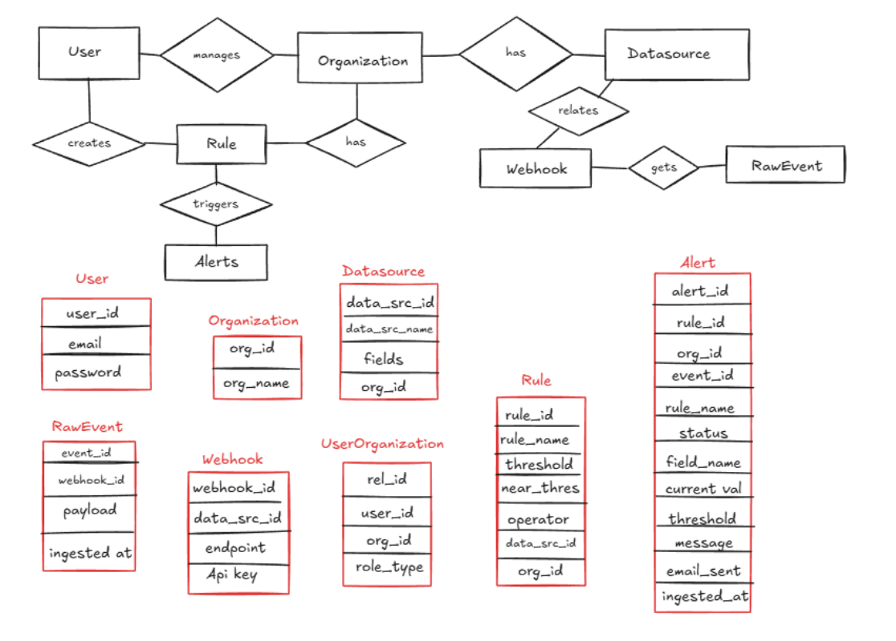

# Breach-Detection-Agent (Orix Maclaren Hackathon)

## Proactive Event Monitoring & Rule-Based Alerting System

We managed to secure the runners up place in the hackathon for this project.

A proactive monitoring platform that continuously evaluates events from
multiple external systems, identifies rule violations and near-breaches,
and notifies teams before critical failures occur.

The system is designed to shift organizations from **reactive
monitoring** to **proactive risk prevention**.

------------------------------------------------------------------------

## Problem Statement

**Most systems today rely on reactive monitoring --- issues are detected
only after thresholds are breached, when damage may already have
occurred.**

With high-volume event data coming from multiple external systems,
manually tracking rule violations is:

-   Slow
-   Error-prone
-   Difficult to scale
-   Difficult to audit
-   Highly dependent on manual intervention

There is a need for a proactive and automated rule-checking system that
can:

-   Continuously evaluate incoming data
-   Detect rule violations and near-breaches early
-   Automatically generate actionable alerts
-   Maintain historical event and alert information
-   Notify responsible teams before critical failures occur

### Our Approach

The system continuously processes incoming events, evaluates
configurable rules, detects potential risks, and generates explainable
alerts.

This transforms monitoring from:

> **Reactive Firefighting → Proactive Risk Prevention**

------------------------------------------------------------------------

# System Overview

The platform follows an **event-driven architecture**.

### System





------------------------------------------------------------------------

# Features

## 01. Event-Driven Architecture

-   Multiple external systems can send raw events.
-   Events are ingested asynchronously through a queue.
-   Decouples event producers from event processing.
-   Supports high-volume event ingestion.
-   Batch writes are used to reduce database overhead instead of
    performing one database write per event.

### Benefits

-   Better scalability
-   Improved reliability
-   Reduced database load
-   Asynchronous processing
-   Easier integration with additional external systems

------------------------------------------------------------------------

## 02. Alerting System

The system automatically generates alerts when configured rules are
violated or when an event approaches a critical threshold.

### Key Capabilities

-   Explainable alerts
-   Rule-level alert information
-   Alert severity
-   Event context
-   Timestamp and historical tracking
-   Persistent alert records for auditing
-   Email notifications to external users

### Example

``` text
Rule: Transaction Failure Rate

Current Value: 8.7%
Warning Threshold: 8%
Critical Threshold: 10%

Status: ⚠️ Near Breach

Action:
Notify responsible team before the critical threshold is reached.
```

------------------------------------------------------------------------

## 03. Flexible Rule Execution

Rules can be executed in multiple ways depending on the use case.

### Scheduled Execution

Rules can run automatically at predefined intervals.

Examples:

-   Every 5 minutes
-   Hourly
-   Daily
-   Periodically based on business requirements

### On-Demand Execution

Users can manually trigger rule evaluation when required.

This is useful for:

-   Immediate investigation
-   Troubleshooting
-   Testing new rules
-   Re-running checks after corrective actions

------------------------------------------------------------------------

## 04. Trends & Historical Analysis

All events and alerts are persisted for historical analysis and
auditing.

Users can analyze:

-   Alert frequency
-   Rule violation trends
-   Event volume
-   Recurring failures
-   Historical threshold breaches
-   Rule-wise risk patterns
-   System health over time

A rule that generates an increasing number of alerts over several weeks
can indicate an emerging operational problem even if the critical
threshold has not yet been reached.

This enables teams to identify **patterns instead of isolated
incidents**.

------------------------------------------------------------------------

# Alert Lifecycle

``` text
Incoming Event
      │
      ▼
Validate Event
      │
      ▼
Evaluate Rules
      │
      ├──────────────► No Violation
      │
      ▼
Near-Breach / Violation
      │
      ▼
Generate Alert
      │
      ▼
Persist Alert
      │
      ▼
Notify User
      │
      ▼
Track & Audit
```

------------------------------------------------------------------------

# Future Scope of Work

The current system provides the foundation for proactive monitoring. The
following capabilities can further extend the platform.

## 01. 📈 Trend & Predictive Alerts

Use advanced Machine Learning algorithms to analyze historical events
and predict future trends.

Instead of only asking:

> "Has the threshold been breached?"

the system can answer:

> "Based on the current trend, is this metric likely to breach the
> threshold soon?"

Potential capabilities:

-   Predictive threshold breach detection
-   Time-series forecasting
-   Anomaly detection
-   Risk scoring
-   Early-warning alerts
-   Historical pattern recognition

This would allow teams to take action **before a violation occurs**.

------------------------------------------------------------------------

## 02.  Multi-Channel Notifications

Extend the current email notification system to support multiple
communication channels.

Potential integrations:

-   Slack
-   Microsoft Teams
-   Webhooks
-   SMS
-   Email
-   Push notifications

Users could configure notification preferences based on:

-   Rule
-   Severity
-   Team
-   Event type
-   Escalation level

For example:

``` text
WARNING  → Email
CRITICAL → Slack + Email + SMS
```

------------------------------------------------------------------------

## 03. Advanced Rule Capabilities

The rule engine can be extended to support more sophisticated business
logic.

Future capabilities could include:

-   Compound rules using `AND` / `OR`
-   Nested conditions
-   Cross-metric validation
-   Cross-event validation
-   Time-window based rules
-   Aggregation-based rules
-   Dynamic thresholds
-   Rule dependencies

### Example

``` text
IF
    transaction_failure_rate > 5%
AND
    transaction_volume > 10,000
AND
    average_response_time > 2 seconds

THEN
    Generate Critical Alert
```

This would allow the platform to support complex real-world monitoring
scenarios.

------------------------------------------------------------------------

## 04. Anomaly Detection

Introduce machine-learning-based anomaly detection to identify unusual
behavior without requiring every threshold to be manually configured.

For example:

``` text
Normal traffic:
10,000 - 15,000 events/hour

Current traffic:
32,000 events/hour

→ Potential anomaly detected
```

This can help identify previously unknown failure patterns.

------------------------------------------------------------------------

## 05. Monitoring Dashboard

Introduce a centralized dashboard providing real-time visibility into
system health.

Possible dashboard metrics:

-   Total events processed
-   Active alerts
-   Critical alerts
-   Rules triggered
-   Alert trends
-   Event volume
-   Most frequently violated rules
-   System health
-   Notification delivery status

------------------------------------------------------------------------

## 06. Role-Based Access Control

Introduce role-based access control for enterprise usage.

Possible roles:

-   Administrator
-   Monitoring Manager
-   Rule Manager
-   Analyst
-   Viewer

Permissions can control who can:

-   Create rules
-   Modify rules
-   Trigger rules manually
-   View alerts
-   Configure notifications
-   Access historical data

------------------------------------------------------------------------

## 07. Scalability & High Availability

The architecture can be extended to support significantly larger event
volumes.

Potential improvements:

-   Horizontal scaling of event processors
-   Multiple queue consumers
-   Database partitioning
-   Caching
-   Retry mechanisms
-   Dead-letter queues
-   Fault-tolerant processing
-   Containerized deployment

This would allow the system to process events reliably at enterprise
scale.

------------------------------------------------------------------------

# Technology Stack

### Backend

-   Python
-   REST APIs
-   Event-driven processing
-   Rule evaluation engine

### Frontend

-   React / Next.js
-   JavaScript / TypeScript
-   Dashboard-based monitoring

### Data & Messaging

-   Database for events and alerts
-   Message queue for asynchronous event ingestion
-   Batch processing for efficient persistence

### Notifications

-   Email
-   Future: Slack, Webhooks, SMS, Microsoft Teams

------------------------------------------------------------------------

# Setup

## Create Virtual Environment

``` bash
python -m venv venv
```

### Windows PowerShell

``` powershell
.\venv\Scripts\activate.ps1
```

### Bash

``` bash
.\venv\Scripts\activate
```

------------------------------------------------------------------------

## Install Dependencies

``` bash
pip install -r requirements.txt
```

------------------------------------------------------------------------

## Environment Variables

Refer to `.env.example` and create a `.env` file at the same level as
the example file.

------------------------------------------------------------------------

## Start Backend

``` bash
python run.py
```

------------------------------------------------------------------------

# Run External System Simulator

The external system simulator generates test events for demonstrating
the event-driven workflow.

``` bash
cd ExternalSystem
python external_system_simulator.py
```

------------------------------------------------------------------------

# Run Frontend

Navigate to the frontend directory.

### Install Dependencies

``` bash
npm i
```

### Configure Environment

Create a `.env` file:

``` env
NEXT_PUBLIC_BACKEND_URL=http://localhost:8000
```

### Development

``` bash
npm start
```

### Production Build

``` bash
npm run build
```

### Run Production Build

``` bash
npm run start
```

------------------------------------------------------------------------

# Test Data

Test data is available in the:

``` text
ExternalSystemFolder
```

The external system simulator can be used to generate events and
demonstrate the complete monitoring and alerting workflow.

------------------------------------------------------------------------

# End-to-End Workflow

``` text
External System
       ↓
Generate Event
       ↓
Message Queue
       ↓
Event Consumer
       ↓
Batch Persistence
       ↓
Rule Evaluation
       ↓
 ┌─────┴─────┐
 ↓           ↓
Normal    Near-Breach /
          Violation
              ↓
         Alert Created
              ↓
       Notification Sent
              ↓
      Historical Analysis
              ↓
       Trend Detection
              ↓
     Predictive Monitoring
```

------------------------------------------------------------------------

# Key Value Proposition

The platform provides a foundation for moving from **"detect and
react"** to **"predict and prevent."**

### Today

``` text
Event
  ↓
Threshold Breached
  ↓
Incident
  ↓
Alert
  ↓
Manual Response
```

### Future

``` text
Event
  ↓
Continuous Analysis
  ↓
Trend Detection
  ↓
Predicted Risk
  ↓
Early Warning
  ↓
Preventive Action
```

------------------------------------------------------------------------

# Impact

The proposed solution can help organizations:

-   Reduce incident response time
-   Detect risks earlier
-   Reduce manual monitoring effort
-   Improve operational visibility
-   Maintain an auditable history of events and alerts
-   Scale monitoring across multiple external systems
-   Identify recurring operational problems
-   Move toward predictive and intelligent monitoring

------------------------------------------------------------------------

# Vision

> **Build an intelligent monitoring platform that doesn't just tell
> teams when something went wrong --- it tells them what is likely to go
> wrong next, and gives them enough time to prevent it.**
